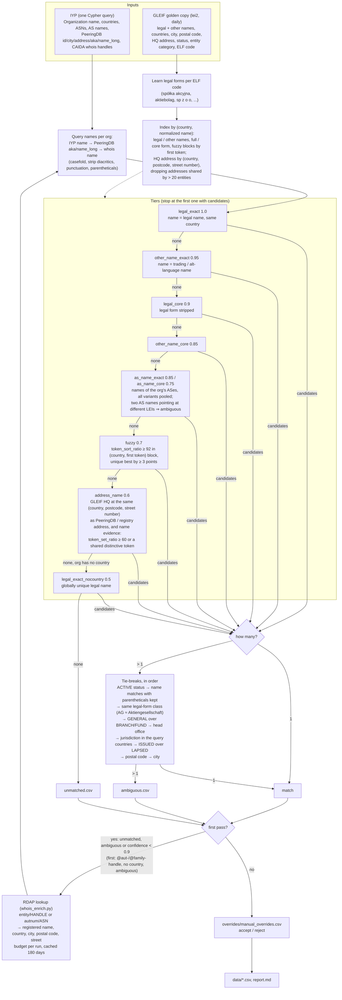

# IYP ↔ GLEIF matchmaking ❤️

Curated mapping between [Internet Yellow Pages](https://iyp.iijlab.net) `Organization`
nodes and [GLEIF](https://www.gleif.org) Legal Entity Identifiers (LEI), regenerated
weekly by a GitHub Action and committed to `data/`.

IYP does not reconcile data sources at import time, so this reconciliation lives here as
a reviewable, versioned dataset, meant to be imported by an IYP crawler as
`(:Organization)-[:EXTERNAL_ID {match_method, confidence}]->(:LEI)`. Precision is
favoured over recall: anything with several equally good candidates is reported as
ambiguous rather than guessed. Consumers should filter on `confidence`; `>= 0.9` is a
sensible default.

## Outputs (`data/`)

| file | content |
|---|---|
| `iyp_gleif_mapping.csv` | one row per matched organization: IYP name, LEI, GLEIF legal name and HQ address, `match_method`, `confidence`, `hint`, PeeringDB/CAIDA IDs, countries, number of ASes |
| `ambiguous.csv` | organizations with several equally good LEI candidates, with LEI, country, category, city and status per candidate. **Review these first** (largest `iyp_n_as` first) and resolve them in `overrides/` |
| `unmatched.csv` | organizations with no candidate |
| `report.md` | statistics, also shown as the Action's job summary |
| `learned_legal_forms.json` | legal-form suffixes learned from the golden copy, per ELF code |
| `metadata.json` | run metadata |

## Decision process



### Notes on the steps

**Country blocking.** GLEIF records are indexed under the union of legal jurisdiction,
legal-address country and HQ country; an organization is only compared with records in
its IYP countries (or, failing that, its registry country, `hint` = `whois_country`).
`ANNULLED` and `DUPLICATE` registrations are excluded.

**Legal forms.** A curated list is extended with forms learned from the golden copy: for
each ISO 20275 ELF code, name tails shared by ≥ 20% of the entities under that code
(a blacklist keeps `trust`, `bank`, `group`, ... from being learned). The result is in
`data/learned_legal_forms.json`.

**Why candidates tie.** Case and punctuation are removed before comparison, so two
same-looking candidates are two distinct LEI records: a head office and its foreign
branches (GLEIF registers branches under the head office's name, e.g. `UBS AG` in CH and
in US), the same core under different legal forms (`Deutsche Bank Aktiengesellschaft` vs
`Deutsche Bank Stiftung`), a foreign group member that the country block pulls in through
its HQ country (`Allergan Inc`, registered in Ontario, headquartered in New Jersey, next
to the Delaware `ALLERGAN, INC.` — the `jurisdiction` tie-break picks the one registered
in the organization's own country), a lapsed registration beside its replacement
(`FMR, LLC` vs `FMR LLC`, resolved by `issued_only`), an entity that differs from another
only by a parenthetical, which name normalization removes (`Swisscom (Schweiz) AG` vs
`Swisscom AG`, resolved by `exact_paren`), or unrelated same-name entities (four
`United Community Bank`s). Only the last stays ambiguous, unless PeeringDB or the
registry provides a city or postal code.

Jurisdiction is compared before registration status on purpose: a lapsed record of the
right entity is a better answer than a current record of a foreign namesake.

**AS names.** `(:AS)-[:NAME]->(:Name)` gives the names of the networks an
organization manages. RIPE's asnames file is the useful source: its value is the
aut-num handle followed by its `descr`, which for RIPE-region networks is often the
legal name (`DTAG Deutsche Telekom AG`), so the name is also tried without its first
token when that token is uppercase and the rest is not. This is the weakest name
evidence in the pipeline, for two reasons, and is handled accordingly:

- An AS name names a *network*, not a legal entity. Names that are handles, single
  tokens or made only of generic words (`GOOGLE`, `AS-COGENT`, and `Communications
  Corporation`, which is what survives stripping the handle guess from `NTT
  Communications Corporation`) are discarded: at least one token must be neither a
  legal form, an industry word nor a number.
- An organization can manage networks named after different entities. All AS names of
  an organization are therefore pooled within a tier instead of being tried one after
  the other, so an organization whose AS names point at two different LEIs is reported
  as ambiguous rather than matched on whichever name came first.

Matches from this tier carry `as_name` in `hint`, the AS name used in `matched_name`,
and their own confidences (0.85 exact, 0.75 core). `report.md` lists them in a separate
section so the first runs can be reviewed; if the sample looks noisy, filter on
`confidence >= 0.9` or drop the tier.

**Address tier.** Operating subsidiaries rarely hold the LEI; their parent or an
affiliate at the same headquarters usually does (`Cogent Communications, LLC` vs GLEIF's
`Cogent Communications Group, Inc.`, both at 2450 N Street NW). The `address_name` tier
blocks on GLEIF's **HQ** address (the legal address of US entities is often a registered
agent shared by thousands of LEIs) keyed by country, postal code and street number, and
requires name evidence: `token_set_ratio ≥ 60` between core names or a shared token that
is not a legal form or a generic word (communications, networks, services, ...).
Addresses shared by more than 20 entities (registered agents, carrier hotels, law firms)
are never used. Addresses come from PeeringDB (already in IYP, no lookup needed) and from
the registry. Because this tier mostly lands on a parent or affiliate rather than the
exact entity holding the AS, its confidence is 0.6 and the method label is distinct, so an
importer can treat it as a corporate-family link rather than an identifier. When both the
group and a holding company sit at the same address the result is ambiguous; resolve it
in `overrides/`.

**Registry data.** CAIDA IDs are whois handles (`LPL-141-ARIN`, `ORG-DTAG1-RIPE`,
`@aut-2497-JPNIC`). Every organization not matched at ≥ 0.9 is eligible for one RDAP
lookup because the registered address feeds the address tier; those where the registry
also adds a name or a country (`@aut-`/`@family-` handles, no country in IYP, ambiguous)
go first. Bulk whois dumps are not usable (RIPE/APNIC dummify organisation objects;
ARIN/LACNIC need an agreement). Requests are throttled per host and a 429/5xx disables
that host for the run.

**The ceiling.** LEIs are held by entities active in financial markets; 78% of unmatched
organizations manage a single AS and most have no LEI at all. `diagnose_unmatched.py`
samples the unmatched set against the GLEIF search API (60 req/min, run by hand) and
reports how many have a near-identical entity in GLEIF (a recall problem) versus none
(no LEI):

```sh
uv run python diagnose_unmatched.py --sample 300 --min-as 2
```

## Manual overrides

`overrides/manual_overrides.csv` is applied last; pushing to it re-runs the Action.

```csv
iyp_org_name,lei,action
Acme Networks,529900ABCDEFGHIJKL12,accept
Cogent Communication Group Inc,LEI...,reject
```

`accept` forces a match (replacing the automatic one); `reject` drops that match, or every
match for the organization if `lei` is empty.

## Running locally

Requires [uv](https://docs.astral.sh/uv/); dependencies are pinned in `uv.lock`.

```sh
uv sync
uv run match-gleif                                       # public IYP + latest golden copy (~300 MB zip)
uv run match-gleif --gleif-zip cache/gleif-lei2-YYYY-MM-DD.csv.zip   # reuse a download
uv run match-gleif --rdap-budget 0                       # cached registry lookups only
uv run match-gleif --iyp-csv orgs.csv --gleif-zip test.zip --no-whois  # offline test
```

Environment: `IYP_BOLT_URI`, `IYP_USER`, `IYP_PASSWORD` (default: public IYP instance),
`RDAP_BUDGET` (default 3000). The Action reads the same names from repository
variables/secrets and keeps `cache/rdap_cache.json` in the Actions cache.

## Next steps

- IYP crawler importing `iyp_gleif_mapping.csv` plus GLEIF Level 1 attributes and Level 2
  parent relationships for the matched LEIs.
- Decide how the IYP crawler models `address_name` matches (identifier vs. corporate
  family); GLEIF Level 2 parent data could confirm them.
- Query NIR RDAP servers (JPNIC, KRNIC, ...) directly; use website domains as an extra
  signal.

## Data terms

GLEIF golden copy files are provided free of charge under the
[LEI Data Terms of Use](https://www.gleif.org/en/meta/lei-data-terms-of-use).
